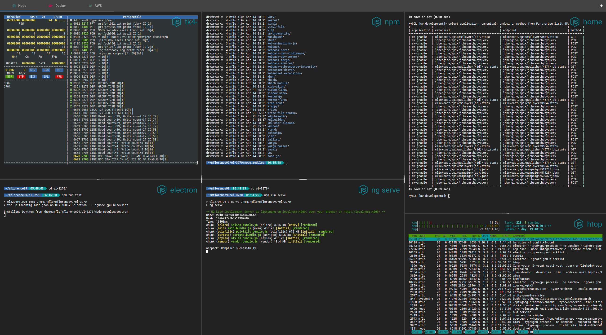
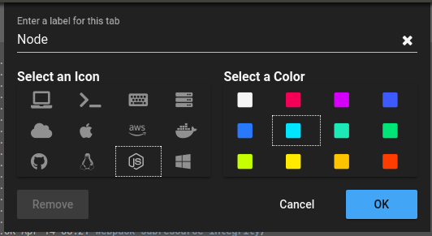

# El terminador

EL-Term is an Electron-based Terminal Emulator. Because I'm sure I'll be the only user, I've taken the liberty of dubbing it _El terminador_. I built it primarily because I didn't like any of the emulators I saw when I moved from using my Mac for development to Linux. None I thought were as complete as [iTerm2](https://www.iterm2.com/) and even that venerable tool, with its layers of profile-setting dialogs, can be difficult to set up.

<!-- toc -->

- [Highlights](#highlights)
- [Technology Stack](#technology-stack)
- [How to Run in Development Mode](#how-to-run-in-development-mode)
- [How to Run in Production Mode](#how-to-run-in-production-mode)
- [Customization](#customization)
  * [Customizing Tabs](#customizing-tabs)
  * [Customizing Splits](#customizing-splits)
- [Search and Highlight](#search-and-highlight)
- [Tips](#tips)

<!-- tocstop -->

## Highlights



* Arbitrary splits, both horizontal and vertical
* Multiple tabs, each with their own split arrangement
* Customizable badges visually identify sessions
* [Powerline](https://wiki.archlinux.org/index.php/Powerline)-ready, built-in [Roboto Mono](https://github.com/powerline) font
* All customizations (splits, tabs and so on) are automatically persisted
* Looks great on a 4k monitor!

## Technology Stack

First of all, none of what I attempted to do would amount to anything without the support of [xterm.js](https://xtermjs.org/) and [node-pty](https://github.com/Tyriar/node-pty). These two first-class projects fit each other hand-in-glove. In addition, I have relied heavily on one of the best tech stacks currently available:

* [Electron](https://electronjs.org/) to build a cross-platform desktop app with [TypeScript](http://www.typescriptlang.org/), HTML and CSS.
* [Angular](https://angular.io/docs) as a framework for SPAs.
* Thorsten Hans' [ngx-electron](https://github.com/ThorstenHans/ngx-electron) to expose Electron's API to Angular.
* The context menu is driven by the impressive [ngx-contextmenu](https://github.com/isaacplmann/ngx-contextmenu).
* [Angular Material](https://material.angular.io/) for UI components.
* [Font Awesome](https://fontawesome.com)'s awesome library of icons.
* The amazing [ngxs](https://ngxs.gitbooks.io/ngxs/) state management pattern.
* [angular-split](https://bertrandg.github.io/angular-split/#/) handles all the details of the arbitrary splits that _El terminador_ supports.
* [angular4-drag-drop](https://bitbucket.org/IpponMattRitter/angular4-drag-drop) allows tabs to be reordered.

## How to Run in Development Mode

One time only, you'll need to grab the code.

```sh
git clone https://github.com/mflorence99/el-term.git
cd el-term
npm install
```

Next, start the dev server for the Angular client. This way, hot reload of the client is supported.

```sh
npm run serve
```

Finally, in another session, start the Electron app itself.

```sh
npm run test
```

## How to Run in Production Mode

> NOTE: this currently only works for Ubuntu / Debian.

> I need to host the installation files.

One time only, you'll need to grab the code.

```sh
git clone https://github.com/mflorence99/el-term.git
cd el-term
npm install
```

Then package and install _El terminador_.

```sh
npm run package
npm run deb64
npm run deb64-install
```

## Customization

I wanted to move away from the way most terminal emulators use profiles for customization. For me, the added layer of indirection is cumbersome and their huge number of customization combinations all but define the [Paradox of Choice](https://en.wikipedia.org/wiki/The_Paradox_of_Choice).

So in _El terminador_ you can't pick a font, or a font size, or change background or text colors. Instead:

* You associate an icon and a color to each tab
* Both identify each split under that tab
* An individual split can be given badge text to further visually identify it

### Customizing Tabs

Click on the tab's icon.



### Customizing Splits

Right-click the split to be customized and select `Preferences...`.


## Search and Highlight

Right-click the split to be searched and select `Search...`. The search string is remembered and text containing it will be highlighted as it is shown. This feature is very useful, for example, when a session produces stack traces. You can specify a search string that picks out your application's stack trace entries for easier visual parsing.


## Tips

* The `Broadcast...` facility is very handy for dealing with multiple sessions at once.
* `Swap with...` is invaluable when rearranging a complex layout of splits.
* To reorder tabs, click and drag the tab's label to its new position.
